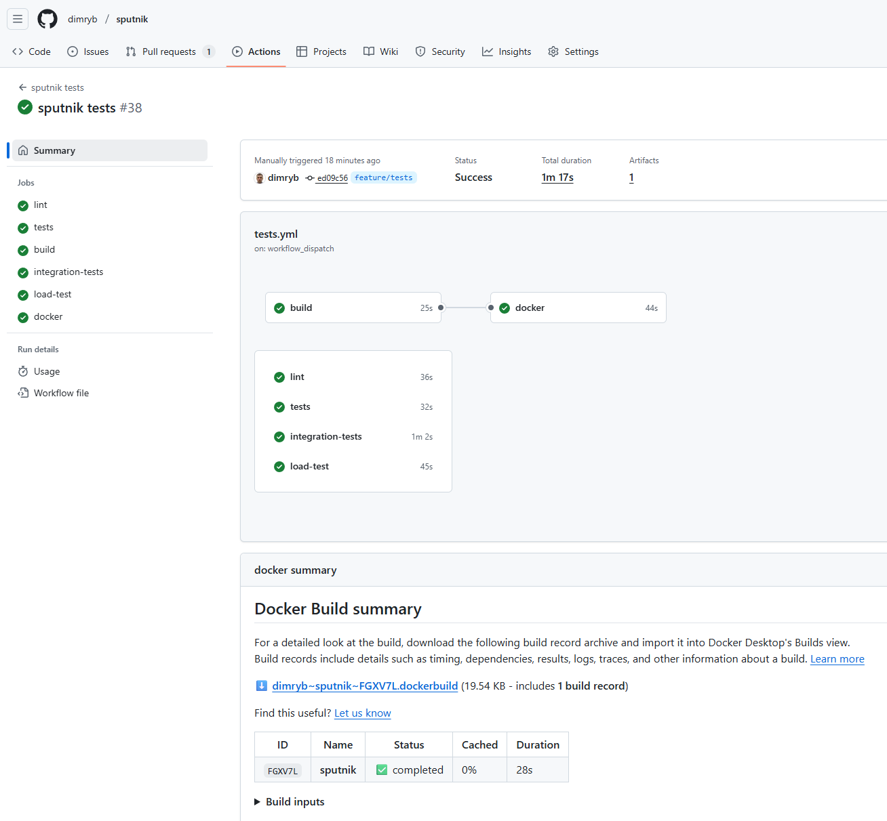
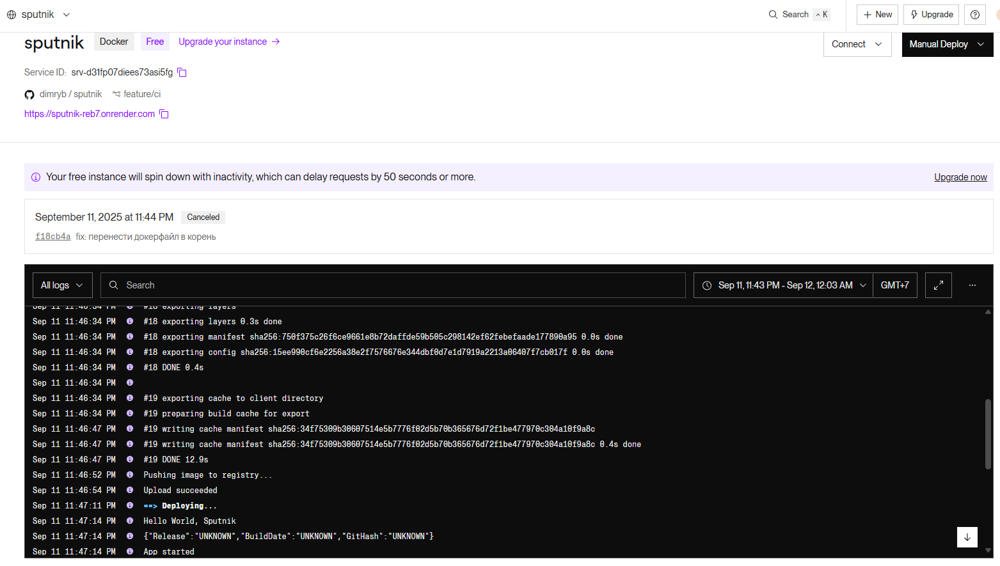

# sputnik

Проект представляет собой простое Go-приложение для демонстрации:
- Правильной структуры приложения
- Локальной сборки с линтерами
- CI/CD-пайплайна
- Упаковки в Docker
- Деплоя на сервере через GitHub Container Registry (GHCR)

## Структура проекта

```
sputnik/
├── cmd/
│   └── app/
│       ├── main.go
│       └── version.go
├── configs/
│   └── config.yaml
├── internal/
│   ├── app/
│   │   └── app.go
│   ├── config/
│   │   └── config.go
│   ├── interface/
│   │   ├── application.go
│   │   └── logger.go
│   ├── logger/
│   │   └── logger.go
│   ├── server/
│   │   └── http/
│   │      ├── handlers.go
│   │      ├── middleware.go
│   │      └── server.go
│   └── service/
│       └── sputnik.go
├── docker-compose.ci.yml
├── docker-compose.e2e.yml
├── Dockerfile
├── Makefile
├── go.mod
├── golangci.yml
└── README.md
```

> Модульность: используем `go mod`, все зависимости в `go.sum`.

---

## Сборка и запуск

### 1. Установка зависимостей

```bash
make install-lint-deps
```

### 2. Проверка кода

```bash
make lint
make test
```

### 3. Сборка бинарника

```bash
make build
```

### 4. Запуск

```bash
make run
```

→ Выведет:
```
Hello World, Sputnik
{"Release":"develop","BuildDate":"...","GitHash":"..."}
App started
App stopped
```

---

## Тестирование

### Юнит-тесты
Запускаются автоматически в CI и локально:
```bash
make test
```

### Интеграционные тесты
Требуют запущенного сервиса. Запускаются вручную:
```bash
make ci-test
```
В GitHub Actions — через **ручной запуск workflow** `Integration Tests`.

### Нагрузочное тестирование
Выполняет 100 запросов к `/health`:
```bash
make load-test
```
В GitHub Actions — через отдельный workflow **`Load Test`** (ручной запуск).  
Результаты сохраняются в `reports/load-report.txt` и описаны в `load-test-report.md`.

---

## Docker-образ

### 1. Собрать образ

```bash
make build-sputnik-img
```

### 2. Запустить локально

```bash
make run-docker
```

### 3. Пушить в GHCR

```bash
make push-sputnik
```

→ Образ доступен по адресу:  
`ghcr.io/dimryb/sputnik:latest`

---

## CI/CD-пайплайн

Полный пайплайн настроен в `.github/workflows/tests.yml`:

### Этапы:
1. **`lint`** — проверка кода `golangci-lint`
2. **`tests`** — запуск тестов
3. **`build`** — сборка бинарника
4. **`docker`** — сборка и пуш образа в GHCR

### Ручные этапы:
- **`Integration Tests`** — интеграционные тесты (`workflow_dispatch`)
- **`Load Test`** — нагрузочное тестирование (`workflow_dispatch`)


### Скриншот успешного CI/CD


> *Скриншот из GitHub Actions: все шаги прошли без ошибок.*

---

## Деплой на сервере

Использовал Render.com: 

1. Создано приложение: `sputnik`
2. Выбран язык: `Docker`
3. Используется `Dockerfile` из корня
4. Приложение запущено как background worker


> *Скриншот из Render.com: своего сервера у меня нет!*
